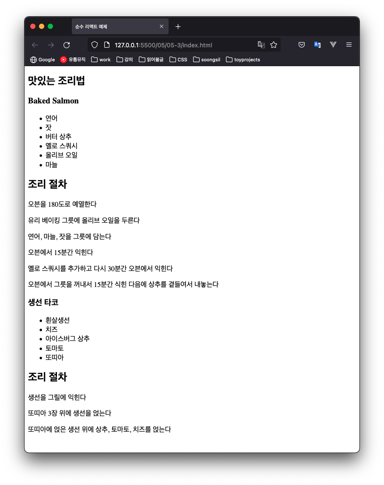

# JSX를 사용하는 리액트 

4장에서는 리액트가 어떻게 동작하는지 알아보면서 리액트 애플리케이션을 컴포넌트로 나눠봤다.  
createElement 함수는 리액트의 동작을 살펴보는 데 좋은 방법이지만 복잡한 트리 구조를 나타내기에 복잡하다.  
리액트를 활용해 효과적으로 일하기 위해 **JSX**라는 다른 요소를 사용한다. 

**JSX**는 자바스크립트의 JS + XML 을 합친말이다.  
자바스크립트 코드 안에서 바로 태그 기반의 구문을 써서 리액트 엘리먼트를 정의할 수 있게 해주는 확장이다.  

## 5.1 JSX로 리액트 엘리먼트 정의하기  

JSX는 속성이 붙은 복잡한 DOM 트리를 작성할 수 있는 간편한 문법을 제공한다.  

```javascript
// React Element
React.createElement(IngredientsList, {list: [...]})

// JSX
<IngredientsList list={[...]}>
```

JSX에서 데이터를 컴포넌트에 넘길때 중괄호({})로 감싸야한다.  
이렇게 중괄호로 감싼 코드를 자바스크립트 식이라고 부른다.  

### 5.1.1 JSX 팁 

- **컴포넌트 안에 컴포넌트**  
  JSX에서는 다른 컴포넌트의 자식으로 컴포넌트를 추가할 수 있다.  

  ```html
  <IngredientsList>
    <Ingredient />
    <Ingredient />
    <Ingredient />
  </IngredientsList>
  ```

- **className**  
  자바스크립트에서 class 가 예약어이므로 class 속성 대신 **className**을 사용하자. 

- **자바스크립트 식**  
  중괄호로 식을 감싸면 중괄호 안의 식을 평가해서 결과값을 사용한다.  
  예를 들어 엘리먼트 안에 title 프로퍼티 값을 출력하고 싶다면 변수를 식안에 써준다.  
  ```html
  <h1>{title}</h1>
  ```

  문자열이 아닌 다른 타입의 값도 식안에서 사용할 수 있다.  

### 5.1.2 배열을 JSX로 매핑하기  

자바스크립트 함수 안에서 JSX를 직접 사용할 수 있다. 배열을 JSX 엘리먼트로 변환해보자. 
```jsx
<ul>
  {
    props.ingredients.map((ingredient, i) => (
<li key={i}> {ingredient} </li>
    ))
  }
</ul>
```

JSX는 깔끔하고 읽기 쉽지만, 브라우저는 JSX를 해석할 수 없다.  
다행히 브라우저가 해석할 수 있게 **바벨** 이라는 유용한 도구가 있다.  


## 5.2 바벨  

자바스크립트는 인터프리터 언어라서 브라우저가 코드 텍스트를 해석하기 때문에 컴파일할 필요가 없다.  
하지만 모든 브라우저가 최신 자바스크립트 문법나 JSX를 지원하지는 않는다.  
우리는 JSX와 최신 문법을 활용하고 싶기 때문에 **코드를 브라우저가 해석할 수 있도록 변환해 줄 수단**이 필요하다.  

바벨을 사용하는 방법은 가장 쉽게 바벨 CDN 링크를 직접 HTML에 포함시키는 것이다.  
이러면 타입이 "text/babel" 인 script 블록을 바벨이 컴파일해준다.  

```html
<script src="https://cdnjs.cloudflare.com/ajax/libs/babel-standalone/6.26.0/babel.min.js"></script>

<script type="text/babel">
   // JSX 코드나 별도의 자바스크립트 코드 
</script>
```

## 5.3 JSX로 작성하는 레시피  

데이터 배열에는 2가지 조리법이 들어있고, 애플리케이션의 현재 상태를 나타낸다.  
이 레시피를 가지고 2가지 컴포넌트가 들어있는 UI를 만들 수 있다.  

Menu 컴포넌트는 조리법의 목록을 표시하고, Recipe 컴포넌트는 각 조리법의 UI를 렌더링한다.  
DOM에 렌더링하는 대상은 Menu 컴포넌트이고, 데이터를 Menu 컴포넌트의 recipes 프로퍼티로 넘긴다.  

```javascript
// 데이터 

const data = [
  {
    name: 'Baked Salmon',
    ingredients: [
      { name: '연어', amount: 500, measurements: '그램' },
      { name: '잣',  amount: 1,   measurements: '컵' },
      { name: '버터 상추',  amount: 2,   measurements: '컵' },
      { name: '옐로 스쿼시',  amount: 1,   measurements: '개' },
      { name: '올리브 오일',  amount: 0.5,   measurements: '컵' },
      { name: '마늘',  amount: 3,   measurements: '쪽' },
    ],
    steps: [
      '오븐을 180도로 예열한다',
      '유리 베이킹 그릇에 올리브 오일을 두른다',
      '연어, 마늘, 잣을 그릇에 담는다',
      '오븐에서 15분간 익힌다',
      '옐로 스쿼시를 추가하고 다시 30분간 오븐에서 익힌다',
      '오븐에서 그릇을 꺼내서 15분간 식힌 다음에 상추를 곁들여서 내놓는다'
    ]
  },
  {
    name: '생선 타코',
    ingredients: [
      { name: '흰살생선', amount: 500, measurements: '그램' },
      { name: '치즈',  amount: 1,   measurements: '장' },
      { name: '아이스버그 상추',  amount: 2,   measurements: '컵' },
      { name: '토마토',  amount: 2,   measurements: '개(큰 것)' },
      { name: '또띠아',  amount: 3,   measurements: '개' },
    ],
    steps: [
      '생선을 그릴에 익힌다',
      '또띠아 3장 위에 생선을 얹는다',
      '또띠아에 얹은 생선 위에 상추, 토마토, 치즈를 얹는다'
    ]
  }
]

// 조리법 하나를 표현하는 함수 컴포넌트 
function Recipe({ name, ingredients, steps }) {
  return (
    <section id={name.toLowerCase().replace(/ /g, "-")}>
      <h1>{name}</h1>
      <ul className="ingredients">
        { 
          ingredients?.map((ingredient, i) => (
            <li key={i}> {ingredient.name} </li>
          ))
        }
      </ul>

      <section className="instructions">
        <h2>조리 절차</h2>
        { 
          steps.map((step, i) => (
            <p key={i}>{step}</p>
          ))
        }
      </section>
    </section>
  )
}

// 조리법으로 이뤄진 메뉴를 표현하는 상태가 없는 함수 컴포넌트 
function Menu({ title, recipes }) {
  return (
    <article>
      <header>
        <h1>{title}</h1>
      </header>

      <div className="recipes">
        { 
          recipes.map((recipe, i) => (
            <Recipe key={i} {...recipe} />
          ))
        }
      </div>
    </article>
  )
}

// ReactDOM.render를 호출해서 Menu를 현재의 DOM 안에 렌더링
ReactDOM.render(
  <Menu recipes={data} title="맛있는 조리법" />,
  document.getElementById('root')
)
```




## 5.4 리액트 프래그먼트  

앞 절에서는 Menu 컴포넌트를 렌더링했다. 이 컴포넌트는 부모 컴포넌트로, 자식인 Recipe 컴포넌트를 렌더링했다.  
**리액트 프래그먼트**를 사용해 두 형제 컴포넌트를 렌더링하는 예제를 살펴보자.  

```javascript
function Cat({name}) {
  return (
    <h1> 고양이 이름은 {name} 입니다.</h1>
    <p>이 고양이는 멋져요</p>
  )
}
ReactDOM.render(<Cat name="나비" />, document.getElementById("root"))
```

위 코드를 실행하면 **div** 와 같은 태그로 둘러싸지 않아서 에러가 발생한다.  
이로 인해 불필요한 태그가 만들어지고, 아무 목적도 없이 태그를 작성하게 된다.  
그래서 리액트 프래그먼트를 사용하면 새로운 태그를 실제로 만들지 않아도 이런 래퍼의 동작을 흉내낼 수 있다.  

```javascript
function Cat({name}) {
  return (
    <React.Fragment>
      <h1> 고양이 이름은 {name} 입니다.</h1>
      <p>이 고양이는 멋져요</p>
    </React.Fragment>
  )
}
ReactDOM.render(<Cat name="나비" />, document.getElementById("root"))
```

인접한 태그들을 **React.Fragment** 태그로 둘러싸주면 경고가 사라진다.  
결과 DOM 을 확인해도 DOM을 오염시키는 추가 래퍼 태그를 사용하지 않아도 된다.  

